本章包含快速上手（基于内存、sqlite、mysql、redis的历史消息存储）+ 源码解读（advisor基础、BaseChatMemoryAdvisor解读、AdvisorChain链）

# 基于内存的消息存储快速上手 

> [!TIP]
> 用于在 AI 模型的请求和响应流程中插入自定义逻辑

以下实现了 advisor 中有基于内存的历史消息存储的 chat 交互

### pom 文件

```xml
<dependencies>
    <dependency>
        <groupId>org.springframework.boot</groupId>
        <artifactId>spring-boot-starter-web</artifactId>
    </dependency>

    <dependency>
        <groupId>org.springframework.ai</groupId>
        <artifactId>spring-ai-autoconfigure-model-openai</artifactId>
    </dependency>

    <dependency>
        <groupId>org.springframework.ai</groupId>
        <artifactId>spring-ai-autoconfigure-model-chat-client</artifactId>
    </dependency>

</dependencies>
```

### application.yml

```yml
server:
  port: 8080

spring:
  application:
    name: advisor-base

  ai:
    openai:
      api-key: ${DASHSCOPEAPIKEY}
      base-url: https://dashscope.aliyuncs.com/compatible-mode
      chat:
        options:
          model: qwen-max
```

### controller

#### MemoryMessageAdvisorController

```java
package com.spring.ai.tutorial.advisor.controller;

import org.springframework.ai.chat.client.ChatClient;
import org.springframework.ai.chat.client.advisor.MessageChatMemoryAdvisor;
import org.springframework.ai.chat.memory.InMemoryChatMemoryRepository;
import org.springframework.ai.chat.memory.MessageWindowChatMemory;
import org.springframework.ai.chat.messages.Message;
import org.springframework.web.bind.annotation.GetMapping;
import org.springframework.web.bind.annotation.RequestMapping;
import org.springframework.web.bind.annotation.RequestParam;
import org.springframework.web.bind.annotation.RestController;

import java.util.List;

import static org.springframework.ai.chat.memory.ChatMemory.CONVERSATIONID;

@RestController
@RequestMapping("/advisor/memory/message")
public class MemoryMessageAdvisorController {

    private final ChatClient chatClient;
    private final InMemoryChatMemoryRepository chatMemoryRepository = new InMemoryChatMemoryRepository();
    private final int MAXMESSAGES = 100;
    private final MessageWindowChatMemory messageWindowChatMemory = MessageWindowChatMemory.builder()
            .chatMemoryRepository(chatMemoryRepository)
            .maxMessages(MAXMESSAGES)
            .build();

    public MemoryMessageAdvisorController(ChatClient.Builder builder) {
        this.chatClient = builder
                .defaultAdvisors(
                        MessageChatMemoryAdvisor.builder(messageWindowChatMemory)
                                .build()
                )
                .build();
    }

    @GetMapping("/call")
    public String call(@RequestParam(value = "query", defaultValue = "你好，我的外号是影子，请记住呀") String query,
                       @RequestParam(value = "conversationid", defaultValue = "yingzi") String conversationId
                       ) {
        return chatClient.prompt(query)
                .advisors(
                        a -> a.param(CONVERSATIONID, conversationId)
                )
                .call().content();
    }

    @GetMapping("/messages")
    public List<Message> messages(@RequestParam(value = "conversationid", defaultValue = "yingzi") String conversationId) {
        return messageWindowChatMemory.get(conversationId);
    }

}
```

##### 效果

以会话 Id=“yingzi”，先告知模型我的名字

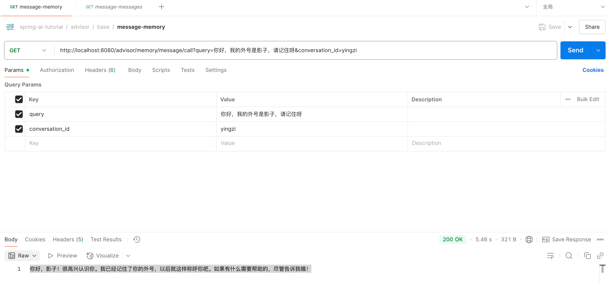

再以同一个会话 Id=“yingzi”，模型能根据以往的消息记住了我的名字

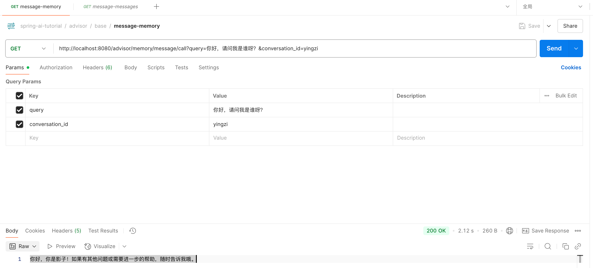

获取历史消息记录，我们能得到历史消息记录

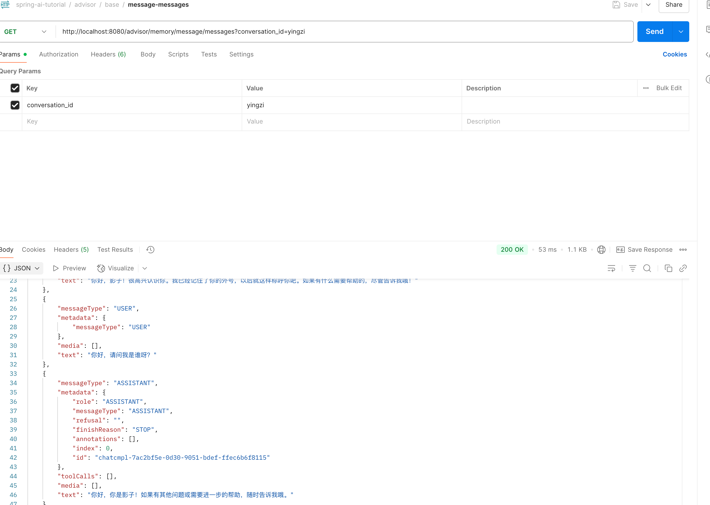

#### MemoryPromptAdvisorController

```java
package com.spring.ai.tutorial.advisor.controller;

import org.springframework.ai.chat.client.ChatClient;
import org.springframework.ai.chat.client.advisor.PromptChatMemoryAdvisor;
import org.springframework.ai.chat.memory.InMemoryChatMemoryRepository;
import org.springframework.ai.chat.memory.MessageWindowChatMemory;
import org.springframework.ai.chat.messages.Message;
import org.springframework.web.bind.annotation.GetMapping;
import org.springframework.web.bind.annotation.RequestMapping;
import org.springframework.web.bind.annotation.RequestParam;
import org.springframework.web.bind.annotation.RestController;

import java.util.List;

import static org.springframework.ai.chat.memory.ChatMemory.CONVERSATIONID;

@RestController
@RequestMapping("/advisor/memory/prompt")
public class MemoryPromptAdvisorController {

    private final ChatClient chatClient;
    private final InMemoryChatMemoryRepository chatMemoryRepository = new InMemoryChatMemoryRepository();
    private final int MAXMESSAGES = 100;
    private final MessageWindowChatMemory messageWindowChatMemory = MessageWindowChatMemory.builder()
            .chatMemoryRepository(chatMemoryRepository)
            .maxMessages(MAXMESSAGES)
            .build();

    public MemoryPromptAdvisorController(ChatClient.Builder builder) {
        this.chatClient = builder
                .defaultAdvisors(
                        PromptChatMemoryAdvisor.builder(messageWindowChatMemory)
                                .build()
                )
                .build();
    }

    @GetMapping("/call")
    public String call(@RequestParam(value = "query", defaultValue = "你好，我的外号是影子，请记住呀") String query,
                       @RequestParam(value = "conversationid", defaultValue = "yingzi") String conversationId
    ) {
        return chatClient.prompt(query)
                .advisors(
                        a -> a.param(CONVERSATIONID, conversationId)
                )
                .call().content();
    }

    @GetMapping("/messages")
    public List<Message> messages(@RequestParam(value = "conversationid", defaultValue = "yingzi") String conversationId) {
        return messageWindowChatMemory.get(conversationId);
    }
}
```

##### 效果

以会话 Id=“yingzi”，先告知模型我的名字

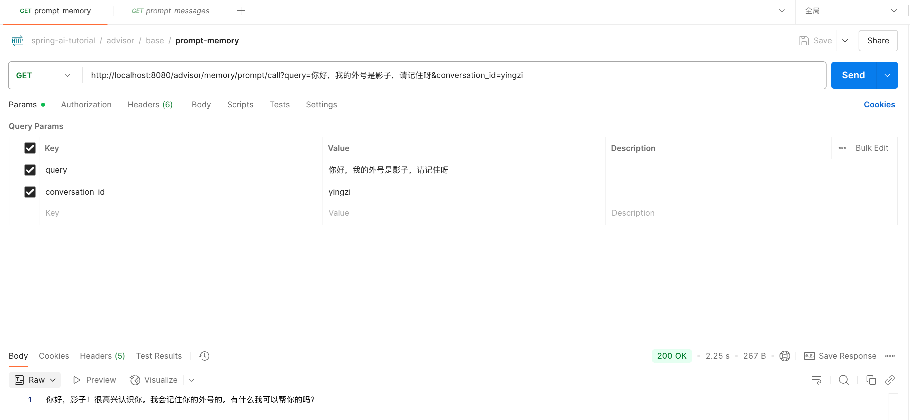

再以同一个会话 Id=“yingzi”，模型能根据以往的消息记住了我的名字

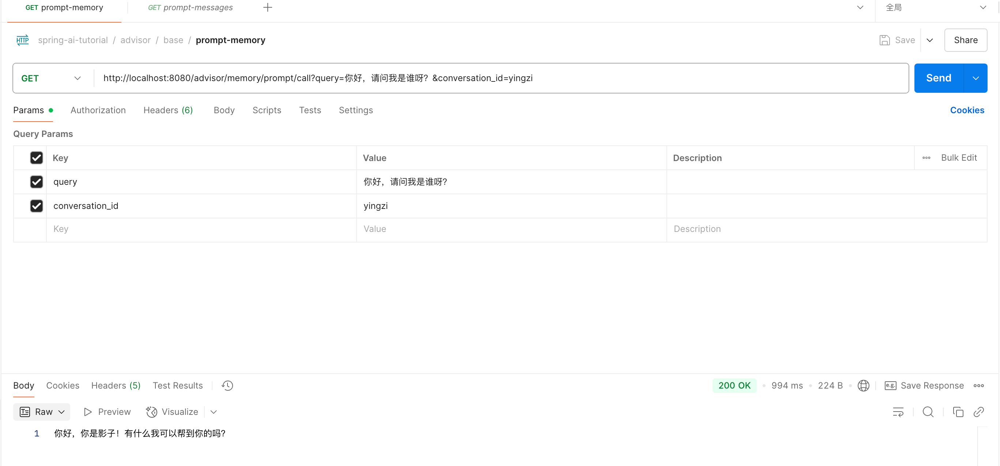

获取历史消息记录，我们能得到历史消息记录

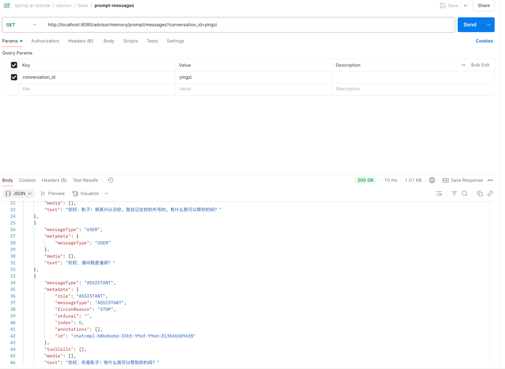


# （增强）基于 sqlite、mysql、redis 的消息存储

> [!TIP]
> 实现了基于 sqlite、mysql、redis 的消息存储

### pom 文件

```xml
<properties>
    <sqlite.verson>3.49.1.0</sqlite.verson>
    <mysql.version>8.0.32</mysql.version>
    <jedis.version>5.2.0</jedis.version>
</properties>


<dependencies>
    <dependency>
        <groupId>org.springframework.boot</groupId>
        <artifactId>spring-boot-starter-web</artifactId>
    </dependency>

    <dependency>
        <groupId>org.springframework.ai</groupId>
        <artifactId>spring-ai-autoconfigure-model-openai</artifactId>
    </dependency>

    <dependency>
        <groupId>org.springframework.ai</groupId>
        <artifactId>spring-ai-autoconfigure-model-chat-client</artifactId>
    </dependency>


    <dependency>
        <groupId>com.alibaba.cloud.ai</groupId>
        <artifactId>spring-ai-alibaba-starter-memory</artifactId>
    </dependency>

    <dependency>
        <groupId>com.alibaba.cloud.ai</groupId>
        <artifactId>spring-ai-alibaba-starter-memory-jdbc</artifactId>
    </dependency>
    
    <dependency>
        <groupId>com.alibaba.cloud.ai</groupId>
        <artifactId>spring-ai-alibaba-starter-memory-redis</artifactId>
    </dependency>

    <dependency>
        <groupId>org.xerial</groupId>
        <artifactId>sqlite-jdbc</artifactId>
        <version>${sqlite.verson}</version>
    </dependency>
    
    <dependency>
        <groupId>mysql</groupId>
        <artifactId>mysql-connector-java</artifactId>
        <version>${mysql.version}</version>
    </dependency>
    
    <dependency>
        <groupId>redis.clients</groupId>
        <artifactId>jedis</artifactId>
        <version>${jedis.version}</version>
    </dependency>

</dependencies>
```

### application.yml

```yml
server:
  port: 8080

spring:
  application:
    name: advisor-memory-mysql

  ai:
    openai:
      api-key: ${DASHSCOPEAPIKEY}
      base-url: https://dashscope.aliyuncs.com/compatible-mode
      chat:
        options:
          model: qwen-max

    chat:
      memory:
        repository:
          jdbc:
            mysql:
              jdbc-url: jdbc:mysql://localhost:3306/springaialibabamysql?useUnicode=true&characterEncoding=utf-8&useSSL=false&allowPublicKeyRetrieval=true&zeroDateTimeBehavior=convertToNull&transformedBitIsBoolean=true&allowMultiQueries=true&tinyInt1isBit=false&allowLoadLocalInfile=true&allowLocalInfile=true&allowUrl
              username: root
              password: root
              driver-class-name: com.mysql.cj.jdbc.Driver
              enabled: true
              
    memory:
      redis:
        host: localhost
        port: 6379
        timeout:  5000
        password:
```

### Sqllite

#### SqliteMemoryConfig

```java
package com.spring.ai.tutorial.advisor.memory.config;

import com.alibaba.cloud.ai.memory.jdbc.SQLiteChatMemoryRepository;
import org.springframework.context.annotation.Bean;
import org.springframework.context.annotation.Configuration;
import org.springframework.jdbc.core.JdbcTemplate;
import org.springframework.jdbc.datasource.DriverManagerDataSource;

@Configuration
public class SqliteMemoryConfig {

    @Bean
    public SQLiteChatMemoryRepository sqliteChatMemoryRepository() {
        DriverManagerDataSource dataSource = new DriverManagerDataSource();
        dataSource.setDriverClassName("org.sqlite.JDBC");
        dataSource.setUrl("jdbc:sqlite:advisor/advisor-memory-sqlite/src/main/resources/chat-memory.db");
        JdbcTemplate jdbcTemplate = new JdbcTemplate(dataSource);
        return SQLiteChatMemoryRepository.sqliteBuilder()
                .jdbcTemplate(jdbcTemplate)
                .build();
    }
}
```

#### SqliteMemoryController

```java
package com.spring.ai.tutorial.advisor.memory.controller;

import com.alibaba.cloud.ai.memory.jdbc.SQLiteChatMemoryRepository;
import org.springframework.ai.chat.client.ChatClient;
import org.springframework.ai.chat.client.advisor.MessageChatMemoryAdvisor;
import org.springframework.ai.chat.memory.MessageWindowChatMemory;
import org.springframework.ai.chat.messages.Message;
import org.springframework.web.bind.annotation.GetMapping;
import org.springframework.web.bind.annotation.RequestMapping;
import org.springframework.web.bind.annotation.RequestParam;
import org.springframework.web.bind.annotation.RestController;

import java.util.List;

import static org.springframework.ai.chat.memory.ChatMemory.CONVERSATIONID;

@RestController
@RequestMapping("/advisor/memory/sqlite")
public class SqliteMemoryController {

    private final ChatClient chatClient;
    private final int MAXMESSAGES = 100;
    private final MessageWindowChatMemory messageWindowChatMemory;

    public SqliteMemoryController(ChatClient.Builder builder, SQLiteChatMemoryRepository sqliteChatMemoryRepository) {
        this.messageWindowChatMemory = MessageWindowChatMemory.builder()
                .chatMemoryRepository(sqliteChatMemoryRepository)
                .maxMessages(MAXMESSAGES)
                .build();

        this.chatClient = builder
                .defaultAdvisors(
                        MessageChatMemoryAdvisor.builder(messageWindowChatMemory)
                                .build()
                )
                .build();
    }

    @GetMapping("/call")
    public String call(@RequestParam(value = "query", defaultValue = "你好，我的外号是影子，请记住呀") String query,
                       @RequestParam(value = "conversationid", defaultValue = "yingzi") String conversationId
    ) {
        return chatClient.prompt(query)
                .advisors(
                        a -> a.param(CONVERSATIONID, conversationId)
                )
                .call().content();
    }

    @GetMapping("/messages")
    public List<Message> messages(@RequestParam(value = "conversationid", defaultValue = "yingzi") String conversationId) {
        return messageWindowChatMemory.get(conversationId);
    }
}
```

##### 效果

以会话“yingzi”发送消息，此时消息存储至 sqllite

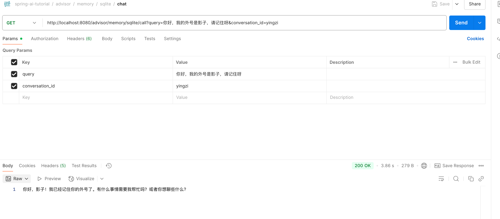

从 sqllite 获取会话“yingzi”对应的消息

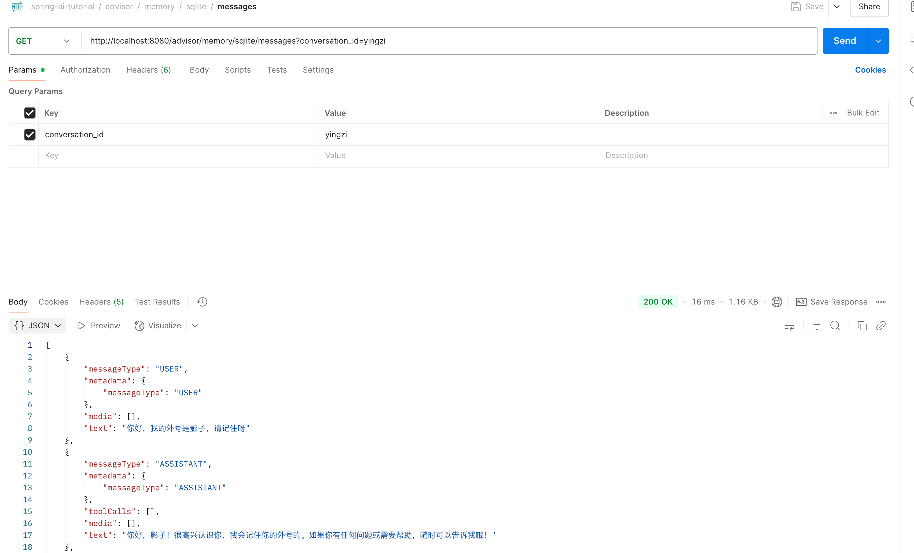

### Mysql

#### MysqlMemoryConfig

```java
package com.spring.ai.tutorial.advisor.memory.config;

import com.alibaba.cloud.ai.memory.jdbc.MysqlChatMemoryRepository;
import org.springframework.beans.factory.annotation.Value;
import org.springframework.context.annotation.Bean;
import org.springframework.context.annotation.Configuration;
import org.springframework.jdbc.core.JdbcTemplate;
import org.springframework.jdbc.datasource.DriverManagerDataSource;

@Configuration
public class MysqlMemoryConfig {

    @Value("${spring.ai.chat.memory.repository.jdbc.mysql.jdbc-url}")
    private String mysqlJdbcUrl;
    @Value("${spring.ai.chat.memory.repository.jdbc.mysql.username}")
    private String mysqlUsername;
    @Value("${spring.ai.chat.memory.repository.jdbc.mysql.password}")
    private String mysqlPassword;
    @Value("${spring.ai.chat.memory.repository.jdbc.mysql.driver-class-name}")
    private String mysqlDriverClassName;

    @Bean
    public MysqlChatMemoryRepository mysqlChatMemoryRepository() {
        DriverManagerDataSource dataSource = new DriverManagerDataSource();
        dataSource.setDriverClassName(mysqlDriverClassName);
        dataSource.setUrl(mysqlJdbcUrl);
        dataSource.setUsername(mysqlUsername);
        dataSource.setPassword(mysqlPassword);
        JdbcTemplate jdbcTemplate = new JdbcTemplate(dataSource);
        return MysqlChatMemoryRepository.mysqlBuilder()
                .jdbcTemplate(jdbcTemplate)
                .build();
    }
}
```

#### MysqlMemoryController

```java
package com.spring.ai.tutorial.advisor.memory.controller;

import com.alibaba.cloud.ai.memory.jdbc.MysqlChatMemoryRepository;
import org.springframework.ai.chat.client.ChatClient;
import org.springframework.ai.chat.client.advisor.MessageChatMemoryAdvisor;
import org.springframework.ai.chat.memory.MessageWindowChatMemory;
import org.springframework.ai.chat.messages.Message;
import org.springframework.web.bind.annotation.GetMapping;
import org.springframework.web.bind.annotation.RequestMapping;
import org.springframework.web.bind.annotation.RequestParam;
import org.springframework.web.bind.annotation.RestController;

import java.util.List;

import static org.springframework.ai.chat.memory.ChatMemory.CONVERSATIONID;

@RestController
@RequestMapping("/advisor/memory/mysql")
public class MysqlMemoryController {

    private final ChatClient chatClient;
    private final int MAXMESSAGES = 100;
    private final MessageWindowChatMemory messageWindowChatMemory;

    public MysqlMemoryController(ChatClient.Builder builder, MysqlChatMemoryRepository mysqlChatMemoryRepository) {
        this.messageWindowChatMemory = MessageWindowChatMemory.builder()
                .chatMemoryRepository(mysqlChatMemoryRepository)
                .maxMessages(MAXMESSAGES)
                .build();

        this.chatClient = builder
                .defaultAdvisors(
                        MessageChatMemoryAdvisor.builder(messageWindowChatMemory)
                                .build()
                )
                .build();
    }

    @GetMapping("/call")
    public String call(@RequestParam(value = "query", defaultValue = "你好，我的外号是影子，请记住呀") String query,
                       @RequestParam(value = "conversationid", defaultValue = "yingzi") String conversationId
    ) {
        return chatClient.prompt(query)
                .advisors(
                        a -> a.param(CONVERSATIONID, conversationId)
                )
                .call().content();
    }

    @GetMapping("/messages")
    public List<Message> messages(@RequestParam(value = "conversationid", defaultValue = "yingzi") String conversationId) {
        return messageWindowChatMemory.get(conversationId);
    }
}
```

##### 效果

以会话“yingzi”发送消息，此时消息存储至 mysql

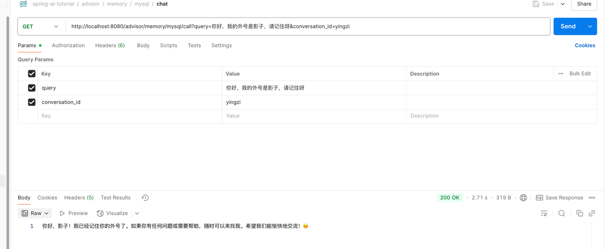

消息被存储至 mysql 中


从 mysql 获取会话“yingzi”对应的消息

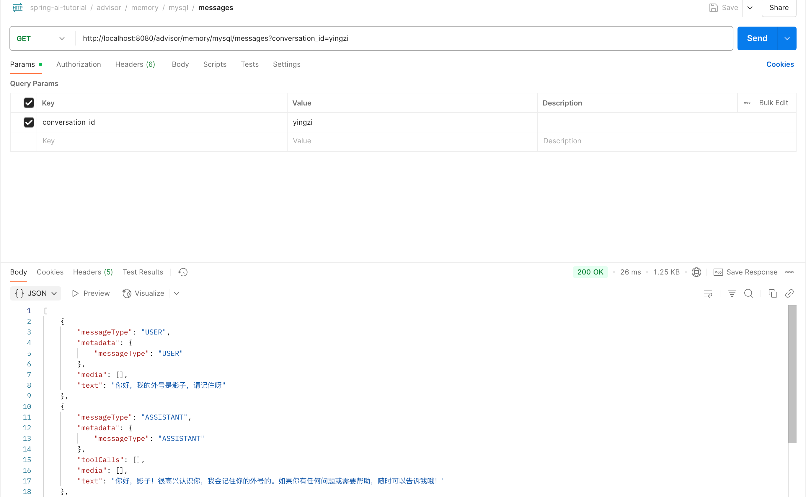

### Redis

#### RedisMemoryConfig

```java
package com.spring.ai.tutorial.advisor.memory.config;

import com.alibaba.cloud.ai.memory.redis.RedisChatMemoryRepository;
import org.springframework.beans.factory.annotation.Value;
import org.springframework.context.annotation.Bean;
import org.springframework.context.annotation.Configuration;

@Configuration
public class RedisMemoryConfig {

    @Value("${spring.ai.memory.redis.host}")
    private String redisHost;
    @Value("${spring.ai.memory.redis.port}")
    private int redisPort;
    @Value("${spring.ai.memory.redis.password}")
    private String redisPassword;
    @Value("${spring.ai.memory.redis.timeout}")
    private int redisTimeout;

    @Bean
    public RedisChatMemoryRepository redisChatMemoryRepository() {
        return RedisChatMemoryRepository.builder()
                .host(redisHost)
                .port(redisPort)
                // 若没有设置密码则注释该项
//           .password(redisPassword)
                .timeout(redisTimeout)
                .build();
    }
}
```

#### RedisMemoryController

```java
package com.spring.ai.tutorial.advisor.memory.controller;

import com.alibaba.cloud.ai.memory.redis.RedisChatMemoryRepository;
import org.springframework.ai.chat.client.ChatClient;
import org.springframework.ai.chat.client.advisor.MessageChatMemoryAdvisor;
import org.springframework.ai.chat.memory.MessageWindowChatMemory;
import org.springframework.ai.chat.messages.Message;
import org.springframework.web.bind.annotation.GetMapping;
import org.springframework.web.bind.annotation.RequestMapping;
import org.springframework.web.bind.annotation.RequestParam;
import org.springframework.web.bind.annotation.RestController;

import java.util.List;

import static org.springframework.ai.chat.memory.ChatMemory.CONVERSATIONID;

@RestController
@RequestMapping("/advisor/memory/redis")
public class RedisMemoryController {

    private final ChatClient chatClient;
    private final int MAXMESSAGES = 100;
    private final MessageWindowChatMemory messageWindowChatMemory;

    public RedisMemoryController(ChatClient.Builder builder, RedisChatMemoryRepository redisChatMemoryRepository) {
        this.messageWindowChatMemory = MessageWindowChatMemory.builder()
                .chatMemoryRepository(redisChatMemoryRepository)
                .maxMessages(MAXMESSAGES)
                .build();

        this.chatClient = builder
                .defaultAdvisors(
                        MessageChatMemoryAdvisor.builder(messageWindowChatMemory)
                                .build()
                )
                .build();
    }

    @GetMapping("/call")
    public String call(@RequestParam(value = "query", defaultValue = "你好，我的外号是影子，请记住呀") String query,
                       @RequestParam(value = "conversationid", defaultValue = "yingzi") String conversationId
    ) {
        return chatClient.prompt(query)
                .advisors(
                        a -> a.param(CONVERSATIONID, conversationId)
                )
                .call().content();
    }

    @GetMapping("/messages")
    public List<Message> messages(@RequestParam(value = "conversationid", defaultValue = "yingzi") String conversationId) {
        return messageWindowChatMemory.get(conversationId);
    }
}
```

##### 效果

以会话“yingzi”发送消息，此时消息存储至 redis

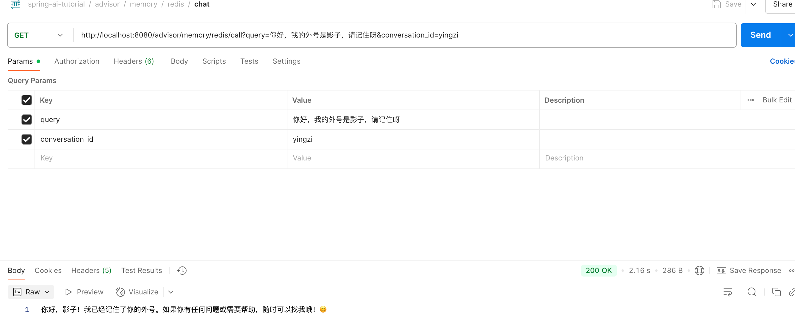

消息被存储至 redis 中


从 redis 获取会话“yingzi”对应的消息

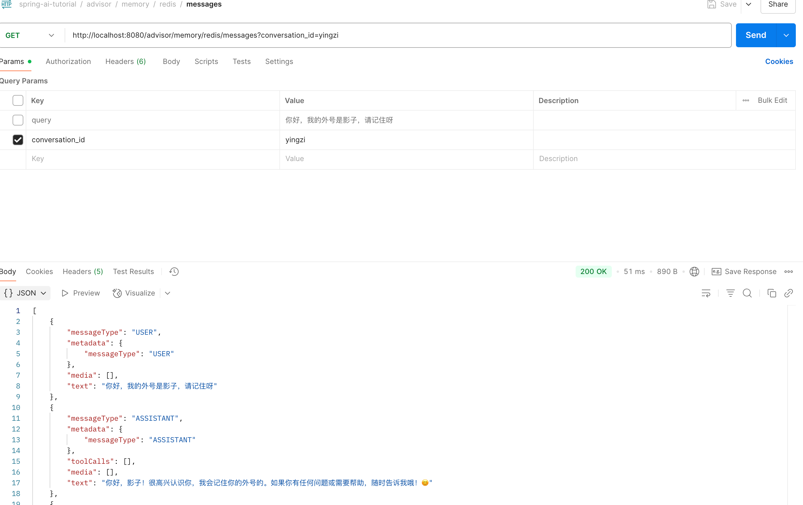


# Advisor 基础

基础提供了 SafeGuardAdvisor、SimpleLoggerAdvisor、ChatModelCallAdvisor、ChatModelStreamAdvisor、基于 BaseChatMemoryAdvisor 扩展的记忆功能

### 架构图

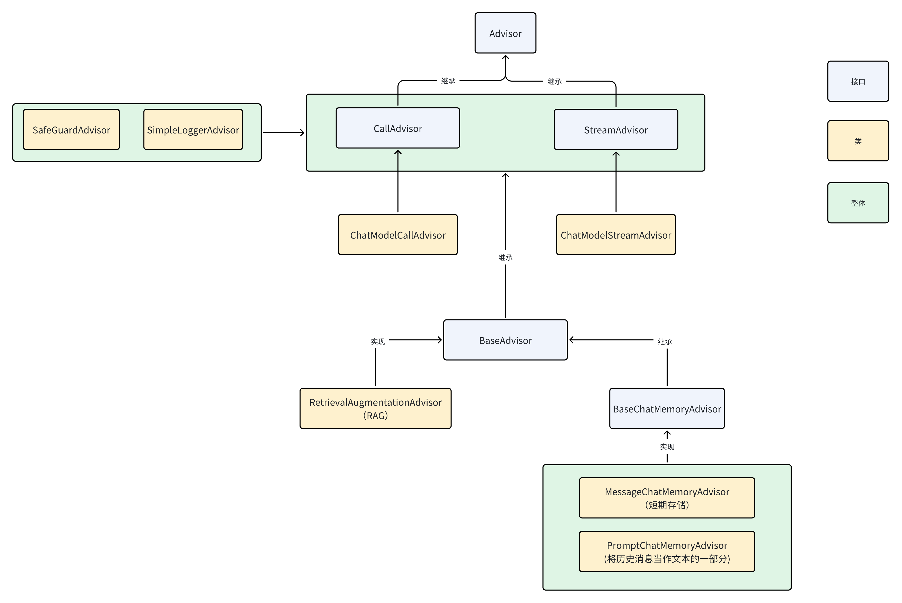

### Advisor

advisor 基础信息配置

- name：指定名字，确保唯一性
- order：数值越小，执行越靠前

```java
package org.springframework.ai.chat.client.advisor.api;

import org.springframework.core.Ordered;

public interface Advisor extends Ordered {
    int DEFAULTCHATMEMORYPRECEDENCEORDER = -2147482648;

    String getName();
}
```

```java
package org.springframework.core;

public interface Ordered {
    int HIGHESTPRECEDENCE = Integer.MINVALUE;
    int LOWESTPRECEDENCE = Integer.MAXVALUE;

    int getOrder();
}
```

#### CallAdvisor

call 调用，跟 AI 模型交互前、后的一些逻辑

```java
package org.springframework.ai.chat.client.advisor.api;

import org.springframework.ai.chat.client.ChatClientRequest;
import org.springframework.ai.chat.client.ChatClientResponse;

public interface CallAdvisor extends Advisor {
    ChatClientResponse adviseCall(ChatClientRequest chatClientRequest, CallAdvisorChain callAdvisorChain);
}
```

#### StreamAdvisor

Stream 调用，跟 AI 模型交互前、后的一些逻

```java
package org.springframework.ai.chat.client.advisor.api;

import org.springframework.ai.chat.client.ChatClientRequest;
import org.springframework.ai.chat.client.ChatClientResponse;
import reactor.core.publisher.Flux;

public interface StreamAdvisor extends Advisor {
    Flux<ChatClientResponse> adviseStream(ChatClientRequest chatClientRequest, StreamAdvisorChain streamAdvisorChain);
}
```

#### BaseAdvisor

类说明：继承 CallAdvisor、StreamAdvisor，提供统一扩展点，统计拦截机制实现与 AI 模型请求和响应后的统一交互逻辑。

字段说明

<table>
<tr>
<td>字段名称<br/></td><td>类型<br/></td><td>描述<br/></td></tr>
<tr>
<td>DEFAULTSCHEDULER<br/></td><td>Scheduler<br/></td><td>定义默认调度器Schedulers.boundedElastic()，用于流式处理时的线程调度<br/></td></tr>
</table>


方法说明

<table>
<tr>
<td>方法名称<br/></td><td>描述<br/></td></tr>
<tr>
<td>adviseCall<br/></td><td>同步调用，拦截call调用AI模型的请求和响应。子类实现before、after方法<br/></td></tr>
<tr>
<td>adviseStream<br/></td><td>流式调用，拦截stream调用AI模型的请求和响应。子类实现before、after方法<br/></td></tr>
<tr>
<td>before<br/></td><td>AI模型请求前的逻辑，需要子类实现<br/></td></tr>
<tr>
<td>after<br/></td><td>AI模型响应后的逻辑，需要子类实现<br/></td></tr>
</table>


```java
package org.springframework.ai.chat.client.advisor.api;

import java.util.Objects;
import org.springframework.ai.chat.client.ChatClientRequest;
import org.springframework.ai.chat.client.ChatClientResponse;
import org.springframework.ai.chat.client.advisor.AdvisorUtils;
import org.springframework.util.Assert;
import reactor.core.publisher.Flux;
import reactor.core.publisher.Mono;
import reactor.core.scheduler.Scheduler;
import reactor.core.scheduler.Schedulers;

public interface BaseAdvisor extends CallAdvisor, StreamAdvisor {
    Scheduler DEFAULTSCHEDULER = Schedulers.boundedElastic();

    default ChatClientResponse adviseCall(ChatClientRequest chatClientRequest, CallAdvisorChain callAdvisorChain) {
        Assert.notNull(chatClientRequest, "chatClientRequest cannot be null");
        Assert.notNull(callAdvisorChain, "callAdvisorChain cannot be null");
        ChatClientRequest processedChatClientRequest = this.before(chatClientRequest, callAdvisorChain);
        ChatClientResponse chatClientResponse = callAdvisorChain.nextCall(processedChatClientRequest);
        return this.after(chatClientResponse, callAdvisorChain);
    }

    default Flux<ChatClientResponse> adviseStream(ChatClientRequest chatClientRequest, StreamAdvisorChain streamAdvisorChain) {
        Assert.notNull(chatClientRequest, "chatClientRequest cannot be null");
        Assert.notNull(streamAdvisorChain, "streamAdvisorChain cannot be null");
        Assert.notNull(this.getScheduler(), "scheduler cannot be null");
        Mono var10000 = Mono.just(chatClientRequest).publishOn(this.getScheduler()).map((request) -> this.before(request, streamAdvisorChain));
        Objects.requireNonNull(streamAdvisorChain);
        Flux<ChatClientResponse> chatClientResponseFlux = var10000.flatMapMany(streamAdvisorChain::nextStream);
        return chatClientResponseFlux.map((response) -> {
            if (AdvisorUtils.onFinishReason().test(response)) {
                response = this.after(response, streamAdvisorChain);
            }

            return response;
        }).onErrorResume((error) -> Flux.error(new IllegalStateException("Stream processing failed", error)));
    }

    default String getName() {
        return this.getClass().getSimpleName();
    }

    ChatClientRequest before(ChatClientRequest chatClientRequest, AdvisorChain advisorChain);

    ChatClientResponse after(ChatClientResponse chatClientResponse, AdvisorChain advisorChain);

    default Scheduler getScheduler() {
        return DEFAULTSCHEDULER;
    }
}
```

### SafeGuardAdvisor

类的作用：在用户输入中检测敏感词，并在发现敏感词时阻止调用模型并返回预设的失败响应

敏感词匹配规则，实现设置一系列敏感词列表，校验提示词中是否包含敏感词

```java
if (!CollectionUtils.isEmpty(this.sensitiveWords)
       && this.sensitiveWords.stream().anyMatch(w -> chatClientRequest.prompt().getContents().contains(w))) {
    return createFailureResponse(chatClientRequest);
}
```

```java
package org.springframework.ai.chat.client.advisor;

import java.util.List;
import java.util.Map;
import org.springframework.ai.chat.client.ChatClientRequest;
import org.springframework.ai.chat.client.ChatClientResponse;
import org.springframework.ai.chat.client.advisor.api.CallAdvisor;
import org.springframework.ai.chat.client.advisor.api.CallAdvisorChain;
import org.springframework.ai.chat.client.advisor.api.StreamAdvisor;
import org.springframework.ai.chat.client.advisor.api.StreamAdvisorChain;
import org.springframework.ai.chat.messages.AssistantMessage;
import org.springframework.ai.chat.model.ChatResponse;
import org.springframework.ai.chat.model.Generation;
import org.springframework.util.Assert;
import org.springframework.util.CollectionUtils;
import reactor.core.publisher.Flux;

public class SafeGuardAdvisor implements CallAdvisor, StreamAdvisor {
    private static final String DEFAULTFAILURERESPONSE = "I'm unable to respond to that due to sensitive content. Could we rephrase or discuss something else?";
    private static final int DEFAULTORDER = 0;
    private final String failureResponse;
    private final List<String> sensitiveWords;
    private final int order;

    public SafeGuardAdvisor(List<String> sensitiveWords) {
        this(sensitiveWords, "I'm unable to respond to that due to sensitive content. Could we rephrase or discuss something else?", 0);
    }

    public SafeGuardAdvisor(List<String> sensitiveWords, String failureResponse, int order) {
        Assert.notNull(sensitiveWords, "Sensitive words must not be null!");
        Assert.notNull(failureResponse, "Failure response must not be null!");
        this.sensitiveWords = sensitiveWords;
        this.failureResponse = failureResponse;
        this.order = order;
    }

    public static Builder builder() {
        return new Builder();
    }

    public String getName() {
        return this.getClass().getSimpleName();
    }

    public ChatClientResponse adviseCall(ChatClientRequest chatClientRequest, CallAdvisorChain callAdvisorChain) {
        return !CollectionUtils.isEmpty(this.sensitiveWords) && this.sensitiveWords.stream().anyMatch((w) -> chatClientRequest.prompt().getContents().contains(w)) ? this.createFailureResponse(chatClientRequest) : callAdvisorChain.nextCall(chatClientRequest);
    }

    public Flux<ChatClientResponse> adviseStream(ChatClientRequest chatClientRequest, StreamAdvisorChain streamAdvisorChain) {
        return !CollectionUtils.isEmpty(this.sensitiveWords) && this.sensitiveWords.stream().anyMatch((w) -> chatClientRequest.prompt().getContents().contains(w)) ? Flux.just(this.createFailureResponse(chatClientRequest)) : streamAdvisorChain.nextStream(chatClientRequest);
    }

    private ChatClientResponse createFailureResponse(ChatClientRequest chatClientRequest) {
        return ChatClientResponse.builder().chatResponse(ChatResponse.builder().generations(List.of(new Generation(new AssistantMessage(this.failureResponse)))).build()).context(Map.copyOf(chatClientRequest.context())).build();
    }

    public int getOrder() {
        return this.order;
    }

    public static final class Builder {
        private List<String> sensitiveWords;
        private String failureResponse = "I'm unable to respond to that due to sensitive content. Could we rephrase or discuss something else?";
        private int order = 0;

        private Builder() {
        }

        public Builder sensitiveWords(List<String> sensitiveWords) {
            this.sensitiveWords = sensitiveWords;
            return this;
        }

        public Builder failureResponse(String failureResponse) {
            this.failureResponse = failureResponse;
            return this;
        }

        public Builder order(int order) {
            this.order = order;
            return this;
        }

        public SafeGuardAdvisor build() {
            return new SafeGuardAdvisor(this.sensitiveWords, this.failureResponse, this.order);
        }
    }
}
```

### SimpleLoggerAdvisor

类的作用：主要用于日志记录，打印请求、响应等信息，默认 JSON 格式化输出

```java
package org.springframework.ai.chat.client.advisor;

import java.util.function.Function;
import org.slf4j.Logger;
import org.slf4j.LoggerFactory;
import org.springframework.ai.chat.client.ChatClientMessageAggregator;
import org.springframework.ai.chat.client.ChatClientRequest;
import org.springframework.ai.chat.client.ChatClientResponse;
import org.springframework.ai.chat.client.advisor.api.CallAdvisor;
import org.springframework.ai.chat.client.advisor.api.CallAdvisorChain;
import org.springframework.ai.chat.client.advisor.api.StreamAdvisor;
import org.springframework.ai.chat.client.advisor.api.StreamAdvisorChain;
import org.springframework.ai.chat.model.ChatResponse;
import org.springframework.ai.model.ModelOptionsUtils;
import org.springframework.lang.Nullable;
import reactor.core.publisher.Flux;

public class SimpleLoggerAdvisor implements CallAdvisor, StreamAdvisor {
    public static final Function<ChatClientRequest, String> DEFAULTREQUESTTOSTRING = ChatClientRequest::toString;
    public static final Function<ChatResponse, String> DEFAULTRESPONSETOSTRING = ModelOptionsUtils::toJsonStringPrettyPrinter;
    private static final Logger logger = LoggerFactory.getLogger(SimpleLoggerAdvisor.class);
    private final Function<ChatClientRequest, String> requestToString;
    private final Function<ChatResponse, String> responseToString;
    private final int order;

    public SimpleLoggerAdvisor() {
        this(DEFAULTREQUESTTOSTRING, DEFAULTRESPONSETOSTRING, 0);
    }

    public SimpleLoggerAdvisor(int order) {
        this(DEFAULTREQUESTTOSTRING, DEFAULTRESPONSETOSTRING, order);
    }

    public SimpleLoggerAdvisor(@Nullable Function<ChatClientRequest, String> requestToString, @Nullable Function<ChatResponse, String> responseToString, int order) {
        this.requestToString = requestToString != null ? requestToString : DEFAULTREQUESTTOSTRING;
        this.responseToString = responseToString != null ? responseToString : DEFAULTRESPONSETOSTRING;
        this.order = order;
    }

    public ChatClientResponse adviseCall(ChatClientRequest chatClientRequest, CallAdvisorChain callAdvisorChain) {
        this.logRequest(chatClientRequest);
        ChatClientResponse chatClientResponse = callAdvisorChain.nextCall(chatClientRequest);
        this.logResponse(chatClientResponse);
        return chatClientResponse;
    }

    public Flux<ChatClientResponse> adviseStream(ChatClientRequest chatClientRequest, StreamAdvisorChain streamAdvisorChain) {
        this.logRequest(chatClientRequest);
        Flux<ChatClientResponse> chatClientResponses = streamAdvisorChain.nextStream(chatClientRequest);
        return (new ChatClientMessageAggregator()).aggregateChatClientResponse(chatClientResponses, this::logResponse);
    }

    private void logRequest(ChatClientRequest request) {
        logger.debug("request: {}", this.requestToString.apply(request));
    }

    private void logResponse(ChatClientResponse chatClientResponse) {
        logger.debug("response: {}", this.responseToString.apply(chatClientResponse.chatResponse()));
    }

    public String getName() {
        return this.getClass().getSimpleName();
    }

    public int getOrder() {
        return this.order;
    }

    public String toString() {
        return SimpleLoggerAdvisor.class.getSimpleName();
    }

    public static Builder builder() {
        return new Builder();
    }

    public static final class Builder {
        private Function<ChatClientRequest, String> requestToString;
        private Function<ChatResponse, String> responseToString;
        private int order = 0;

        private Builder() {
        }

        public Builder requestToString(Function<ChatClientRequest, String> requestToString) {
            this.requestToString = requestToString;
            return this;
        }

        public Builder responseToString(Function<ChatResponse, String> responseToString) {
            this.responseToString = responseToString;
            return this;
        }

        public Builder order(int order) {
            this.order = order;
            return this;
        }

        public SimpleLoggerAdvisor build() {
            return new SimpleLoggerAdvisor(this.requestToString, this.responseToString, this.order);
        }
    }
}
```

### ChatModelCallAdvisor

类的作用：使用注入的 ChatModel 实例执行 AI 模型 call 调用，若上下文中包含OUTPUTFORMAT，会将其附加到用户提示中，以指导模型生成符合预期格式的内容，通常作为增强器链的最后一个

```java
package org.springframework.ai.chat.client.advisor;

import java.util.Map;
import org.springframework.ai.chat.client.ChatClientAttributes;
import org.springframework.ai.chat.client.ChatClientRequest;
import org.springframework.ai.chat.client.ChatClientResponse;
import org.springframework.ai.chat.client.advisor.api.CallAdvisor;
import org.springframework.ai.chat.client.advisor.api.CallAdvisorChain;
import org.springframework.ai.chat.messages.UserMessage;
import org.springframework.ai.chat.model.ChatModel;
import org.springframework.ai.chat.model.ChatResponse;
import org.springframework.ai.chat.prompt.Prompt;
import org.springframework.util.Assert;
import org.springframework.util.StringUtils;

public final class ChatModelCallAdvisor implements CallAdvisor {
    private final ChatModel chatModel;

    private ChatModelCallAdvisor(ChatModel chatModel) {
        Assert.notNull(chatModel, "chatModel cannot be null");
        this.chatModel = chatModel;
    }

    public ChatClientResponse adviseCall(ChatClientRequest chatClientRequest, CallAdvisorChain callAdvisorChain) {
        Assert.notNull(chatClientRequest, "the chatClientRequest cannot be null");
        ChatClientRequest formattedChatClientRequest = augmentWithFormatInstructions(chatClientRequest);
        ChatResponse chatResponse = this.chatModel.call(formattedChatClientRequest.prompt());
        return ChatClientResponse.builder().chatResponse(chatResponse).context(Map.copyOf(formattedChatClientRequest.context())).build();
    }

    private static ChatClientRequest augmentWithFormatInstructions(ChatClientRequest chatClientRequest) {
        String outputFormat = (String)chatClientRequest.context().get(ChatClientAttributes.OUTPUTFORMAT.getKey());
        if (!StringUtils.hasText(outputFormat)) {
            return chatClientRequest;
        } else {
            Prompt augmentedPrompt = chatClientRequest.prompt().augmentUserMessage((userMessage) -> {
                UserMessage.Builder var10000 = userMessage.mutate();
                String var10001 = userMessage.getText();
                return var10000.text(var10001 + System.lineSeparator() + outputFormat).build();
            });
            return ChatClientRequest.builder().prompt(augmentedPrompt).context(Map.copyOf(chatClientRequest.context())).build();
        }
    }

    public String getName() {
        return "call";
    }

    public int getOrder() {
        return Integer.MAXVALUE;
    }

    public static Builder builder() {
        return new Builder();
    }

    public static final class Builder {
        private ChatModel chatModel;

        private Builder() {
        }

        public Builder chatModel(ChatModel chatModel) {
            this.chatModel = chatModel;
            return this;
        }

        public ChatModelCallAdvisor build() {
            return new ChatModelCallAdvisor(this.chatModel);
        }
    }
}
```

### ChatModelStreamAdvisor

类的作用：使用注入的 ChatModel 实例执行 AI 模型 Stream 调用，将模型返回的 Flux<ChatResponse> 转换为标准格式的 Flux<ChatClientResponse>，通常作为增强器链的最后一个

- 默认使用 Schedulers.boundedElastic() 进行线程切换，以避免阻塞主线程或影响响应性

```java
package org.springframework.ai.chat.client.advisor;

import java.util.Map;
import org.springframework.ai.chat.client.ChatClientRequest;
import org.springframework.ai.chat.client.ChatClientResponse;
import org.springframework.ai.chat.client.advisor.api.StreamAdvisor;
import org.springframework.ai.chat.client.advisor.api.StreamAdvisorChain;
import org.springframework.ai.chat.model.ChatModel;
import org.springframework.util.Assert;
import reactor.core.publisher.Flux;
import reactor.core.scheduler.Schedulers;

public final class ChatModelStreamAdvisor implements StreamAdvisor {
    private final ChatModel chatModel;

    private ChatModelStreamAdvisor(ChatModel chatModel) {
        Assert.notNull(chatModel, "chatModel cannot be null");
        this.chatModel = chatModel;
    }

    public Flux<ChatClientResponse> adviseStream(ChatClientRequest chatClientRequest, StreamAdvisorChain streamAdvisorChain) {
        Assert.notNull(chatClientRequest, "the chatClientRequest cannot be null");
        return this.chatModel.stream(chatClientRequest.prompt()).map((chatResponse) -> ChatClientResponse.builder().chatResponse(chatResponse).context(Map.copyOf(chatClientRequest.context())).build()).publishOn(Schedulers.boundedElastic());
    }

    public String getName() {
        return "stream";
    }

    public int getOrder() {
        return Integer.MAXVALUE;
    }

    public static Builder builder() {
        return new Builder();
    }

    public static final class Builder {
        private ChatModel chatModel;

        private Builder() {
        }

        public Builder chatModel(ChatModel chatModel) {
            this.chatModel = chatModel;
            return this;
        }

        public ChatModelStreamAdvisor build() {
            return new ChatModelStreamAdvisor(this.chatModel);
        }
    }
}
```


# BaseChatMemoryAdvisor 解读篇

### BaseChatMemoryAdvisor

类说明：从传入的上下文 Map 中提取会话 Id，若不存在则使用默认值

```java
package org.springframework.ai.chat.client.advisor.api;

import java.util.Map;
import org.springframework.util.Assert;

public interface BaseChatMemoryAdvisor extends BaseAdvisor {
    default String getConversationId(Map<String, Object> context, String defaultConversationId) {
        Assert.notNull(context, "context cannot be null");
        Assert.noNullElements(context.keySet().toArray(), "context cannot contain null keys");
        Assert.hasText(defaultConversationId, "defaultConversationId cannot be null or empty");
        return context.containsKey("chatmemoryconversationid") ? context.get("chatmemoryconversationid").toString() : defaultConversationId;
    }
}
```

#### MessageChatMemoryAdvisor

类的说明：消息记忆存储的 Advisor 类

字段说明

<table>
<tr>
<td>字段名称<br/></td><td>类型<br/></td><td>描述<br/></td></tr>
<tr>
<td>order<br/></td><td>int<br/></td><td>指定顺序<br/></td></tr>
<tr>
<td>defaultConversationId<br/></td><td>String<br/></td><td>默认会话Id<br/></td></tr>
<tr>
<td>chatMemory<br/></td><td>ChatMemory<br/></td><td>聊天记忆接口<br/></td></tr>
<tr>
<td>scheduler<br/></td><td>Scheduler<br/></td><td>流式处理时的线程调度<br/></td></tr>
</table>


方法说明

<table>
<tr>
<td>方法名称<br/></td><td>描述<br/></td></tr>
<tr>
<td>before<br/></td><td>1. 从ChatMemory中取出历史消息<br/>2. 当前消息加入ChatMemory<br/>3. 整合当前消息+历史消息<br/></td></tr>
<tr>
<td>after<br/></td><td>将模型响应的消息加入ChatMemory<br/></td></tr>
<tr>
<td>adviseStream<br/></td><td>覆盖了BaseAdvisor默认实现逻辑<br/>- 注：在将多个流式响应合并成一个完整响应对象后，在调用after，确保只保留完整的模型输出，避免部分信息写入memory导致混乱<br/></td></tr>
</table>


```java
package org.springframework.ai.chat.client.advisor;

import java.util.ArrayList;
import java.util.List;
import java.util.Objects;
import org.springframework.ai.chat.client.ChatClientMessageAggregator;
import org.springframework.ai.chat.client.ChatClientRequest;
import org.springframework.ai.chat.client.ChatClientResponse;
import org.springframework.ai.chat.client.advisor.api.AdvisorChain;
import org.springframework.ai.chat.client.advisor.api.BaseAdvisor;
import org.springframework.ai.chat.client.advisor.api.BaseChatMemoryAdvisor;
import org.springframework.ai.chat.client.advisor.api.StreamAdvisorChain;
import org.springframework.ai.chat.memory.ChatMemory;
import org.springframework.ai.chat.messages.Message;
import org.springframework.ai.chat.messages.UserMessage;
import org.springframework.util.Assert;
import reactor.core.publisher.Flux;
import reactor.core.publisher.Mono;
import reactor.core.scheduler.Scheduler;

public final class MessageChatMemoryAdvisor implements BaseChatMemoryAdvisor {
    private final ChatMemory chatMemory;
    private final String defaultConversationId;
    private final int order;
    private final Scheduler scheduler;

    private MessageChatMemoryAdvisor(ChatMemory chatMemory, String defaultConversationId, int order, Scheduler scheduler) {
        Assert.notNull(chatMemory, "chatMemory cannot be null");
        Assert.hasText(defaultConversationId, "defaultConversationId cannot be null or empty");
        Assert.notNull(scheduler, "scheduler cannot be null");
        this.chatMemory = chatMemory;
        this.defaultConversationId = defaultConversationId;
        this.order = order;
        this.scheduler = scheduler;
    }

    public int getOrder() {
        return this.order;
    }

    public Scheduler getScheduler() {
        return this.scheduler;
    }

    public ChatClientRequest before(ChatClientRequest chatClientRequest, AdvisorChain advisorChain) {
        String conversationId = this.getConversationId(chatClientRequest.context(), this.defaultConversationId);
        List<Message> memoryMessages = this.chatMemory.get(conversationId);
        List<Message> processedMessages = new ArrayList(memoryMessages);
        processedMessages.addAll(chatClientRequest.prompt().getInstructions());
        ChatClientRequest processedChatClientRequest = chatClientRequest.mutate().prompt(chatClientRequest.prompt().mutate().messages(processedMessages).build()).build();
        UserMessage userMessage = processedChatClientRequest.prompt().getUserMessage();
        this.chatMemory.add(conversationId, userMessage);
        return processedChatClientRequest;
    }

    public ChatClientResponse after(ChatClientResponse chatClientResponse, AdvisorChain advisorChain) {
        List<Message> assistantMessages = new ArrayList();
        if (chatClientResponse.chatResponse() != null) {
            assistantMessages = chatClientResponse.chatResponse().getResults().stream().map((g) -> g.getOutput()).toList();
        }

        this.chatMemory.add(this.getConversationId(chatClientResponse.context(), this.defaultConversationId), assistantMessages);
        return chatClientResponse;
    }

    public Flux<ChatClientResponse> adviseStream(ChatClientRequest chatClientRequest, StreamAdvisorChain streamAdvisorChain) {
        Scheduler scheduler = this.getScheduler();
        Mono var10000 = Mono.just(chatClientRequest).publishOn(scheduler).map((request) -> this.before(request, streamAdvisorChain));
        Objects.requireNonNull(streamAdvisorChain);
        return var10000.flatMapMany(streamAdvisorChain::nextStream).transform((flux) -> (new ChatClientMessageAggregator()).aggregateChatClientResponse(flux, (response) -> this.after(response, streamAdvisorChain)));
    }

    public static Builder builder(ChatMemory chatMemory) {
        return new Builder(chatMemory);
    }

    public static final class Builder {
        private String conversationId = "default";
        private int order = -2147482648;
        private Scheduler scheduler;
        private ChatMemory chatMemory;

        private Builder(ChatMemory chatMemory) {
            this.scheduler = BaseAdvisor.DEFAULTSCHEDULER;
            this.chatMemory = chatMemory;
        }

        public Builder conversationId(String conversationId) {
            this.conversationId = conversationId;
            return this;
        }

        public Builder order(int order) {
            this.order = order;
            return this;
        }

        public Builder scheduler(Scheduler scheduler) {
            this.scheduler = scheduler;
            return this;
        }

        public MessageChatMemoryAdvisor build() {
            return new MessageChatMemoryAdvisor(this.chatMemory, this.conversationId, this.order, this.scheduler);
        }
    }
}
```

#### PromptChatMemoryAdvisor

类的说明：将聊天记忆嵌入到系统提示词的 Advisor 类

字段说明

<table>
<tr>
<td>字段名称<br/></td><td>类型<br/></td><td>描述<br/></td></tr>
<tr>
<td>order<br/></td><td>int<br/></td><td>指定顺序<br/></td></tr>
<tr>
<td>defaultConversationId<br/></td><td>String<br/></td><td>默认会话Id<br/></td></tr>
<tr>
<td>chatMemory<br/></td><td>ChatMemory<br/></td><td>聊天记忆接口<br/></td></tr>
<tr>
<td>scheduler<br/></td><td>Scheduler<br/></td><td>流式处理时的线程调度<br/></td></tr>
<tr>
<td>systemPromptTemplate<br/></td><td>PromptTemplate<br/></td><td>当前使用的系统提示模板<br/></td></tr>
</table>


方法说明

<table>
<tr>
<td>方法名称<br/></td><td>描述<br/></td></tr>
<tr>
<td>before<br/></td><td>1. 从ChatMemory中取出历史消息<br/>2. 当前消息加入ChatMemory<br/>3. 将历史消息结合系统提示消息作为最新的系统提示<br/></td></tr>
<tr>
<td>after<br/></td><td>将模型响应的消息加入ChatMemory<br/></td></tr>
<tr>
<td>adviseStream<br/></td><td>覆盖了BaseAdvisor默认实现逻辑<br/>- 注：在将多个流式响应合并成一个完整响应对象后，在调用after，确保只保留完整的模型输出，避免部分信息写入memory导致混乱<br/></td></tr>
</table>


```java
package org.springframework.ai.chat.client.advisor;

import java.util.ArrayList;
import java.util.List;
import java.util.Map;
import java.util.Objects;
import java.util.stream.Collectors;
import org.slf4j.Logger;
import org.slf4j.LoggerFactory;
import org.springframework.ai.chat.client.ChatClientMessageAggregator;
import org.springframework.ai.chat.client.ChatClientRequest;
import org.springframework.ai.chat.client.ChatClientResponse;
import org.springframework.ai.chat.client.advisor.api.AdvisorChain;
import org.springframework.ai.chat.client.advisor.api.BaseAdvisor;
import org.springframework.ai.chat.client.advisor.api.BaseChatMemoryAdvisor;
import org.springframework.ai.chat.client.advisor.api.StreamAdvisorChain;
import org.springframework.ai.chat.memory.ChatMemory;
import org.springframework.ai.chat.messages.Message;
import org.springframework.ai.chat.messages.MessageType;
import org.springframework.ai.chat.messages.SystemMessage;
import org.springframework.ai.chat.messages.UserMessage;
import org.springframework.ai.chat.prompt.PromptTemplate;
import org.springframework.util.Assert;
import reactor.core.publisher.Flux;
import reactor.core.publisher.Mono;
import reactor.core.scheduler.Scheduler;

public final class PromptChatMemoryAdvisor implements BaseChatMemoryAdvisor {
    private static final Logger logger = LoggerFactory.getLogger(PromptChatMemoryAdvisor.class);
    private static final PromptTemplate DEFAULTSYSTEMPROMPTTEMPLATE = new PromptTemplate("{instructions}\n\nUse the conversation memory from the MEMORY section to provide accurate answers.\n\n---------------------\nMEMORY:\n{memory}\n---------------------\n\n");
    private final PromptTemplate systemPromptTemplate;
    private final String defaultConversationId;
    private final int order;
    private final Scheduler scheduler;
    private final ChatMemory chatMemory;

    private PromptChatMemoryAdvisor(ChatMemory chatMemory, String defaultConversationId, int order, Scheduler scheduler, PromptTemplate systemPromptTemplate) {
        Assert.notNull(chatMemory, "chatMemory cannot be null");
        Assert.hasText(defaultConversationId, "defaultConversationId cannot be null or empty");
        Assert.notNull(scheduler, "scheduler cannot be null");
        Assert.notNull(systemPromptTemplate, "systemPromptTemplate cannot be null");
        this.chatMemory = chatMemory;
        this.defaultConversationId = defaultConversationId;
        this.order = order;
        this.scheduler = scheduler;
        this.systemPromptTemplate = systemPromptTemplate;
    }

    public static Builder builder(ChatMemory chatMemory) {
        return new Builder(chatMemory);
    }

    public int getOrder() {
        return this.order;
    }

    public Scheduler getScheduler() {
        return this.scheduler;
    }

    public ChatClientRequest before(ChatClientRequest chatClientRequest, AdvisorChain advisorChain) {
        String conversationId = this.getConversationId(chatClientRequest.context(), this.defaultConversationId);
        List<Message> memoryMessages = this.chatMemory.get(conversationId);
        logger.debug("[PromptChatMemoryAdvisor.before] Memory before processing for conversationId={}: {}", conversationId, memoryMessages);
        String memory = (String)memoryMessages.stream().filter((m) -> m.getMessageType() == MessageType.USER || m.getMessageType() == MessageType.ASSISTANT).map((m) -> {
            String var10000 = String.valueOf(m.getMessageType());
            return var10000 + ":" + m.getText();
        }).collect(Collectors.joining(System.lineSeparator()));
        SystemMessage systemMessage = chatClientRequest.prompt().getSystemMessage();
        String augmentedSystemText = this.systemPromptTemplate.render(Map.of("instructions", systemMessage.getText(), "memory", memory));
        ChatClientRequest processedChatClientRequest = chatClientRequest.mutate().prompt(chatClientRequest.prompt().augmentSystemMessage(augmentedSystemText)).build();
        UserMessage userMessage = processedChatClientRequest.prompt().getUserMessage();
        this.chatMemory.add(conversationId, userMessage);
        return processedChatClientRequest;
    }

    public ChatClientResponse after(ChatClientResponse chatClientResponse, AdvisorChain advisorChain) {
        List<Message> assistantMessages = new ArrayList();
        if (chatClientResponse.chatResponse() != null) {
            assistantMessages = chatClientResponse.chatResponse().getResults().stream().map((g) -> g.getOutput()).toList();
        } else if (chatClientResponse.chatResponse() != null && chatClientResponse.chatResponse().getResult() != null && chatClientResponse.chatResponse().getResult().getOutput() != null) {
            assistantMessages = List.of(chatClientResponse.chatResponse().getResult().getOutput());
        }

        if (!assistantMessages.isEmpty()) {
            this.chatMemory.add(this.getConversationId(chatClientResponse.context(), this.defaultConversationId), assistantMessages);
            logger.debug("[PromptChatMemoryAdvisor.after] Added ASSISTANT messages to memory for conversationId={}: {}", this.getConversationId(chatClientResponse.context(), this.defaultConversationId), assistantMessages);
            List<Message> memoryMessages = this.chatMemory.get(this.getConversationId(chatClientResponse.context(), this.defaultConversationId));
            logger.debug("[PromptChatMemoryAdvisor.after] Memory after ASSISTANT add for conversationId={}: {}", this.getConversationId(chatClientResponse.context(), this.defaultConversationId), memoryMessages);
        }

        return chatClientResponse;
    }

    public Flux<ChatClientResponse> adviseStream(ChatClientRequest chatClientRequest, StreamAdvisorChain streamAdvisorChain) {
        Scheduler scheduler = this.getScheduler();
        Mono var10000 = Mono.just(chatClientRequest).publishOn(scheduler).map((request) -> this.before(request, streamAdvisorChain));
        Objects.requireNonNull(streamAdvisorChain);
        return var10000.flatMapMany(streamAdvisorChain::nextStream).transform((flux) -> (new ChatClientMessageAggregator()).aggregateChatClientResponse(flux, (response) -> this.after(response, streamAdvisorChain)));
    }

    public static final class Builder {
        private PromptTemplate systemPromptTemplate;
        private String conversationId;
        private int order;
        private Scheduler scheduler;
        private ChatMemory chatMemory;

        private Builder(ChatMemory chatMemory) {
            this.systemPromptTemplate = PromptChatMemoryAdvisor.DEFAULTSYSTEMPROMPTTEMPLATE;
            this.conversationId = "default";
            this.order = -2147482648;
            this.scheduler = BaseAdvisor.DEFAULTSCHEDULER;
            this.chatMemory = chatMemory;
        }

        public Builder systemPromptTemplate(PromptTemplate systemPromptTemplate) {
            this.systemPromptTemplate = systemPromptTemplate;
            return this;
        }

        public Builder conversationId(String conversationId) {
            this.conversationId = conversationId;
            return this;
        }

        public Builder scheduler(Scheduler scheduler) {
            this.scheduler = scheduler;
            return this;
        }

        public Builder order(int order) {
            this.order = order;
            return this;
        }

        public PromptChatMemoryAdvisor build() {
            return new PromptChatMemoryAdvisor(this.chatMemory, this.conversationId, this.order, this.scheduler, this.systemPromptTemplate);
        }
    }
}
```

### ChatMemory

类说明：管理会话聊天记忆的接口，提供了保存、获取、清除对话消息的基本功能

字段说明

<table>
<tr>
<td>字段名称<br/></td><td>类型<br/></td><td>描述<br/></td></tr>
<tr>
<td>CONVERSATIONID<br/></td><td>String<br/></td><td>会话Id。当作键，方便提取对应的List<Message><br/></td></tr>
</table>


方法说明

<table>
<tr>
<td>方法名称<br/></td><td>描述<br/></td></tr>
<tr>
<td>add<br/></td><td>添加消息到指定会话Id中<br/></td></tr>
<tr>
<td>get<br/></td><td>根据指定会话Id获取消息<br/></td></tr>
<tr>
<td>clear<br/></td><td>根据会话Id清除消息<br/></td></tr>
</table>


```java
package org.springframework.ai.chat.memory;

import java.util.List;
import org.springframework.ai.chat.messages.Message;
import org.springframework.util.Assert;

public interface ChatMemory {
    String DEFAULTCONVERSATIONID = "default";
    String CONVERSATIONID = "chatmemoryconversationid";

    default void add(String conversationId, Message message) {
        Assert.hasText(conversationId, "conversationId cannot be null or empty");
        Assert.notNull(message, "message cannot be null");
        this.add(conversationId, List.of(message));
    }

    void add(String conversationId, List<Message> messages);

    List<Message> get(String conversationId);

    void clear(String conversationId);
}
```

#### MessageWindowChatMemory

类说明：消息窗口类，提供了保存、获取、清除对话消息的基本功能

字段说明

<table>
<tr>
<td>字段名称<br/></td><td>类型<br/></td><td>描述<br/></td></tr>
<tr>
<td>maxMessages<br/></td><td>int<br/></td><td>当前会话最多保留的消息数量<br/></td></tr>
<tr>
<td>chatMemoryRepository<br/></td><td>ChatMemoryRepository<br/></td><td>存储后端，实现该接口可拓展内存、Mysql、Redis、ES等数据库存储消息<br/></td></tr>
</table>


其他方法说明

<table>
<tr>
<td>方法名称<br/></td><td>描述<br/></td></tr>
<tr>
<td>process<br/></td><td>用于控制消息数量，核心逻辑下<br/>1. 新增 SystemMessage 时，清除之前的 SystemMessage<br/>2. 若消息数超过限制，优先保留SystemMessage<br/></td></tr>
</table>


```java
package org.springframework.ai.chat.memory;

import java.util.ArrayList;
import java.util.HashSet;
import java.util.List;
import java.util.Objects;
import java.util.Set;
import java.util.stream.Stream;
import org.springframework.ai.chat.messages.Message;
import org.springframework.ai.chat.messages.SystemMessage;
import org.springframework.util.Assert;

public final class MessageWindowChatMemory implements ChatMemory {
    private static final int DEFAULTMAXMESSAGES = 20;
    private final ChatMemoryRepository chatMemoryRepository;
    private final int maxMessages;

    private MessageWindowChatMemory(ChatMemoryRepository chatMemoryRepository, int maxMessages) {
        Assert.notNull(chatMemoryRepository, "chatMemoryRepository cannot be null");
        Assert.isTrue(maxMessages > 0, "maxMessages must be greater than 0");
        this.chatMemoryRepository = chatMemoryRepository;
        this.maxMessages = maxMessages;
    }

    public void add(String conversationId, List<Message> messages) {
        Assert.hasText(conversationId, "conversationId cannot be null or empty");
        Assert.notNull(messages, "messages cannot be null");
        Assert.noNullElements(messages, "messages cannot contain null elements");
        List<Message> memoryMessages = this.chatMemoryRepository.findByConversationId(conversationId);
        List<Message> processedMessages = this.process(memoryMessages, messages);
        this.chatMemoryRepository.saveAll(conversationId, processedMessages);
    }

    public List<Message> get(String conversationId) {
        Assert.hasText(conversationId, "conversationId cannot be null or empty");
        return this.chatMemoryRepository.findByConversationId(conversationId);
    }

    public void clear(String conversationId) {
        Assert.hasText(conversationId, "conversationId cannot be null or empty");
        this.chatMemoryRepository.deleteByConversationId(conversationId);
    }

    private List<Message> process(List<Message> memoryMessages, List<Message> newMessages) {
        List<Message> processedMessages = new ArrayList();
        Set<Message> memoryMessagesSet = new HashSet(memoryMessages);
        Stream var10000 = newMessages.stream();
        Objects.requireNonNull(SystemMessage.class);
        boolean hasNewSystemMessage = var10000.filter(SystemMessage.class::isInstance).anyMatch((messagex) -> !memoryMessagesSet.contains(messagex));
        var10000 = memoryMessages.stream().filter((messagex) -> !hasNewSystemMessage || !(messagex instanceof SystemMessage));
        Objects.requireNonNull(processedMessages);
        var10000.forEach(processedMessages::add);
        processedMessages.addAll(newMessages);
        if (processedMessages.size() <= this.maxMessages) {
            return processedMessages;
        } else {
            int messagesToRemove = processedMessages.size() - this.maxMessages;
            List<Message> trimmedMessages = new ArrayList();
            int removed = 0;

            for(Message message : processedMessages) {
                if (!(message instanceof SystemMessage) && removed < messagesToRemove) {
                    ++removed;
                } else {
                    trimmedMessages.add(message);
                }
            }

            return trimmedMessages;
        }
    }

    public static Builder builder() {
        return new Builder();
    }

    public static final class Builder {
        private ChatMemoryRepository chatMemoryRepository;
        private int maxMessages = 20;

        private Builder() {
        }

        public Builder chatMemoryRepository(ChatMemoryRepository chatMemoryRepository) {
            this.chatMemoryRepository = chatMemoryRepository;
            return this;
        }

        public Builder maxMessages(int maxMessages) {
            this.maxMessages = maxMessages;
            return this;
        }

        public MessageWindowChatMemory build() {
            if (this.chatMemoryRepository == null) {
                this.chatMemoryRepository = new InMemoryChatMemoryRepository();
            }

            return new MessageWindowChatMemory(this.chatMemoryRepository, this.maxMessages);
        }
    }
}
```

### ChatMemoryRepository

```java
package org.springframework.ai.chat.memory;

import java.util.List;
import org.springframework.ai.chat.messages.Message;

public interface ChatMemoryRepository {
    List<String> findConversationIds();

    List<Message> findByConversationId(String conversationId);

    void saveAll(String conversationId, List<Message> messages);

    void deleteByConversationId(String conversationId);
}
```

#### InMemoryChatMemoryRepository

类说明：基于内存的实际存储数据，维护一个会话 Id 到消息列表的键值对

```java
package org.springframework.ai.chat.memory;

import java.util.ArrayList;
import java.util.List;
import java.util.Map;
import java.util.concurrent.ConcurrentHashMap;
import org.springframework.ai.chat.messages.Message;
import org.springframework.util.Assert;

public final class InMemoryChatMemoryRepository implements ChatMemoryRepository {
    Map<String, List<Message>> chatMemoryStore = new ConcurrentHashMap();

    public List<String> findConversationIds() {
        return new ArrayList(this.chatMemoryStore.keySet());
    }

    public List<Message> findByConversationId(String conversationId) {
        Assert.hasText(conversationId, "conversationId cannot be null or empty");
        List<Message> messages = (List)this.chatMemoryStore.get(conversationId);
        return (List<Message>)(messages != null ? new ArrayList(messages) : List.of());
    }

    public void saveAll(String conversationId, List<Message> messages) {
        Assert.hasText(conversationId, "conversationId cannot be null or empty");
        Assert.notNull(messages, "messages cannot be null");
        Assert.noNullElements(messages, "messages cannot contain null elements");
        this.chatMemoryStore.put(conversationId, messages);
    }

    public void deleteByConversationId(String conversationId) {
        Assert.hasText(conversationId, "conversationId cannot be null or empty");
        this.chatMemoryStore.remove(conversationId);
    }
}
```

### 问题

#### MessageChatMemoryAdvisor 和 PromptChatMemoryAdvisor 的区别是什么？

PromptChatMemoryAdvisor

1. 有些模型可能可能不支持 messag

   1. 如本地部署，LLaMA、BLOOM 等 text-in/text-out 模型
2. 调试时，希望快速看到完整上下文

MessageChatMemoryAdvisor

1. 需要精确控制消息类型（用户、系统、助手）
2. 使用 OpenAI GPT-3.5/4 等 chat 模型

总结：MessageChatMemoryAdvisor 是面向结构化对话记忆的最佳实践，而 PromptChatMemoryAdvisor 是面向文本提示增强的经典方案

#### 为什么需要覆盖 adviseStream 方法？

在将多个流式响应合并成一个完整响应对象后，在调用 after，确保只保留完整的模型输出，避免部分信息写入 memory 导致混


# AdvisorChain 链

> [!TIP]
> 管理一系列 Advisor调用链路

## AdvisorChain

接口类作用：组织和管理多个 Advsir

```java
package org.springframework.ai.chat.client.advisor.api;

import io.micrometer.observation.ObservationRegistry;

public interface AdvisorChain {
    default ObservationRegistry getObservationRegistry() {
        return ObservationRegistry.NOOP;
    }
}
```

### CallAdvisorChain

接口类：call 增强链接口，链式调用机制将请求传递给下一个增强器

- 支持获取链中所有增强器集合，便于调试

```java
package org.springframework.ai.chat.client.advisor.api;

import java.util.List;
import org.springframework.ai.chat.client.ChatClientRequest;
import org.springframework.ai.chat.client.ChatClientResponse;

public interface CallAdvisorChain extends AdvisorChain {
    ChatClientResponse nextCall(ChatClientRequest chatClientRequest);

    List<CallAdvisor> getCallAdvisors();
}
```

### StreamAdvisorChain

接口类：Stream 增强链接口，链式调用机制将请求传递给下一个增强器

- 支持获取链中所有增强器集合，便于调试

```java
package org.springframework.ai.chat.client.advisor.api;

import java.util.List;
import org.springframework.ai.chat.client.ChatClientRequest;
import org.springframework.ai.chat.client.ChatClientResponse;
import reactor.core.publisher.Flux;

public interface StreamAdvisorChain extends AdvisorChain {
    Flux<ChatClientResponse> nextStream(ChatClientRequest chatClientRequest);

    List<StreamAdvisor> getStreamAdvisors();
}
```

### BaseAdvisorChain

接口类：统一 CallAdvisorChain、StreamAdvisorChain，逻辑复用

```java
public interface BaseAdvisorChain extends CallAdvisorChain, StreamAdvisorChain {
}
```

#### DefaultAroundAdvisorChain

1. 管理多个增强器的执行顺序，通过 reOrder 方法
2. 采取责任链调用机制，使用 nextCall、nextStream 方法将请求传递给下一个增强器
3. 支持观测日志记录，集成 Micrometer Observations，可记录每个增强器的执行上下文和耗时

```java
package org.springframework.ai.chat.client.advisor;

import io.micrometer.observation.Observation;
import io.micrometer.observation.ObservationConvention;
import io.micrometer.observation.ObservationRegistry;
import java.util.ArrayList;
import java.util.Deque;
import java.util.List;
import java.util.Objects;
import java.util.concurrent.ConcurrentLinkedDeque;
import org.springframework.ai.chat.client.ChatClientRequest;
import org.springframework.ai.chat.client.ChatClientResponse;
import org.springframework.ai.chat.client.advisor.api.Advisor;
import org.springframework.ai.chat.client.advisor.api.BaseAdvisorChain;
import org.springframework.ai.chat.client.advisor.api.CallAdvisor;
import org.springframework.ai.chat.client.advisor.api.StreamAdvisor;
import org.springframework.ai.chat.client.advisor.observation.AdvisorObservationContext;
import org.springframework.ai.chat.client.advisor.observation.AdvisorObservationConvention;
import org.springframework.ai.chat.client.advisor.observation.AdvisorObservationDocumentation;
import org.springframework.ai.chat.client.advisor.observation.DefaultAdvisorObservationConvention;
import org.springframework.ai.template.TemplateRenderer;
import org.springframework.ai.template.st.StTemplateRenderer;
import org.springframework.core.OrderComparator;
import org.springframework.lang.Nullable;
import org.springframework.util.Assert;
import org.springframework.util.CollectionUtils;
import reactor.core.publisher.Flux;

public class DefaultAroundAdvisorChain implements BaseAdvisorChain {
    public static final AdvisorObservationConvention DEFAULTOBSERVATIONCONVENTION = new DefaultAdvisorObservationConvention();
    private static final TemplateRenderer DEFAULTTEMPLATERENDERER = StTemplateRenderer.builder().build();
    private final List<CallAdvisor> originalCallAdvisors;
    private final List<StreamAdvisor> originalStreamAdvisors;
    private final Deque<CallAdvisor> callAdvisors;
    private final Deque<StreamAdvisor> streamAdvisors;
    private final ObservationRegistry observationRegistry;
    private final TemplateRenderer templateRenderer;

    DefaultAroundAdvisorChain(ObservationRegistry observationRegistry, @Nullable TemplateRenderer templateRenderer, Deque<CallAdvisor> callAdvisors, Deque<StreamAdvisor> streamAdvisors) {
        Assert.notNull(observationRegistry, "the observationRegistry must be non-null");
        Assert.notNull(callAdvisors, "the callAdvisors must be non-null");
        Assert.notNull(streamAdvisors, "the streamAdvisors must be non-null");
        this.observationRegistry = observationRegistry;
        this.templateRenderer = templateRenderer != null ? templateRenderer : DEFAULTTEMPLATERENDERER;
        this.callAdvisors = callAdvisors;
        this.streamAdvisors = streamAdvisors;
        this.originalCallAdvisors = List.copyOf(callAdvisors);
        this.originalStreamAdvisors = List.copyOf(streamAdvisors);
    }

    public static Builder builder(ObservationRegistry observationRegistry) {
        return new Builder(observationRegistry);
    }

    public ChatClientResponse nextCall(ChatClientRequest chatClientRequest) {
        Assert.notNull(chatClientRequest, "the chatClientRequest cannot be null");
        if (this.callAdvisors.isEmpty()) {
            throw new IllegalStateException("No CallAdvisors available to execute");
        } else {
            CallAdvisor advisor = (CallAdvisor)this.callAdvisors.pop();
            AdvisorObservationContext observationContext = AdvisorObservationContext.builder().advisorName(advisor.getName()).chatClientRequest(chatClientRequest).order(advisor.getOrder()).build();
            return (ChatClientResponse)AdvisorObservationDocumentation.AIADVISOR.observation((ObservationConvention)null, DEFAULTOBSERVATIONCONVENTION, () -> observationContext, this.observationRegistry).observe(() -> advisor.adviseCall(chatClientRequest, this));
        }
    }

    public Flux<ChatClientResponse> nextStream(ChatClientRequest chatClientRequest) {
        Assert.notNull(chatClientRequest, "the chatClientRequest cannot be null");
        return Flux.deferContextual((contextView) -> {
            if (this.streamAdvisors.isEmpty()) {
                return Flux.error(new IllegalStateException("No StreamAdvisors available to execute"));
            } else {
                StreamAdvisor advisor = (StreamAdvisor)this.streamAdvisors.pop();
                AdvisorObservationContext observationContext = AdvisorObservationContext.builder().advisorName(advisor.getName()).chatClientRequest(chatClientRequest).order(advisor.getOrder()).build();
                Observation observation = AdvisorObservationDocumentation.AIADVISOR.observation((ObservationConvention)null, DEFAULTOBSERVATIONCONVENTION, () -> observationContext, this.observationRegistry);
                observation.parentObservation((Observation)contextView.getOrDefault("micrometer.observation", (Object)null)).start();
                return Flux.defer(() -> {
                    Flux var10000 = advisor.adviseStream(chatClientRequest, this);
                    Objects.requireNonNull(observation);
                    return var10000.doOnError(observation::error).doFinally((s) -> observation.stop()).contextWrite((ctx) -> ctx.put("micrometer.observation", observation));
                });
            }
        });
    }

    public List<CallAdvisor> getCallAdvisors() {
        return this.originalCallAdvisors;
    }

    public List<StreamAdvisor> getStreamAdvisors() {
        return this.originalStreamAdvisors;
    }

    public ObservationRegistry getObservationRegistry() {
        return this.observationRegistry;
    }

    public static class Builder {
        private final ObservationRegistry observationRegistry;
        private final Deque<CallAdvisor> callAdvisors;
        private final Deque<StreamAdvisor> streamAdvisors;
        private TemplateRenderer templateRenderer;

        public Builder(ObservationRegistry observationRegistry) {
            this.observationRegistry = observationRegistry;
            this.callAdvisors = new ConcurrentLinkedDeque();
            this.streamAdvisors = new ConcurrentLinkedDeque();
        }

        public Builder templateRenderer(TemplateRenderer templateRenderer) {
            this.templateRenderer = templateRenderer;
            return this;
        }

        public Builder push(Advisor advisor) {
            Assert.notNull(advisor, "the advisor must be non-null");
            return this.pushAll(List.of(advisor));
        }

        public Builder pushAll(List<? extends Advisor> advisors) {
            Assert.notNull(advisors, "the advisors must be non-null");
            Assert.noNullElements(advisors, "the advisors must not contain null elements");
            if (!CollectionUtils.isEmpty(advisors)) {
                List<CallAdvisor> callAroundAdvisorList = advisors.stream().filter((a) -> a instanceof CallAdvisor).map((a) -> (CallAdvisor)a).toList();
                if (!CollectionUtils.isEmpty(callAroundAdvisorList)) {
                    Deque var10001 = this.callAdvisors;
                    Objects.requireNonNull(var10001);
                    callAroundAdvisorList.forEach(var10001::push);
                }

                List<StreamAdvisor> streamAroundAdvisorList = advisors.stream().filter((a) -> a instanceof StreamAdvisor).map((a) -> (StreamAdvisor)a).toList();
                if (!CollectionUtils.isEmpty(streamAroundAdvisorList)) {
                    Deque var4 = this.streamAdvisors;
                    Objects.requireNonNull(var4);
                    streamAroundAdvisorList.forEach(var4::push);
                }

                this.reOrder();
            }

            return this;
        }

        private void reOrder() {
            ArrayList<CallAdvisor> callAdvisors = new ArrayList(this.callAdvisors);
            OrderComparator.sort(callAdvisors);
            this.callAdvisors.clear();
            Deque var10001 = this.callAdvisors;
            Objects.requireNonNull(var10001);
            callAdvisors.forEach(var10001::addLast);
            ArrayList<StreamAdvisor> streamAdvisors = new ArrayList(this.streamAdvisors);
            OrderComparator.sort(streamAdvisors);
            this.streamAdvisors.clear();
            var10001 = this.streamAdvisors;
            Objects.requireNonNull(var10001);
            streamAdvisors.forEach(var10001::addLast);
        }

        public DefaultAroundAdvisorChain build() {
            return new DefaultAroundAdvisorChain(this.observationRegistry, this.templateRenderer, this.callAdvisors, this.streamAdvisors);
        }
    }
}
```
